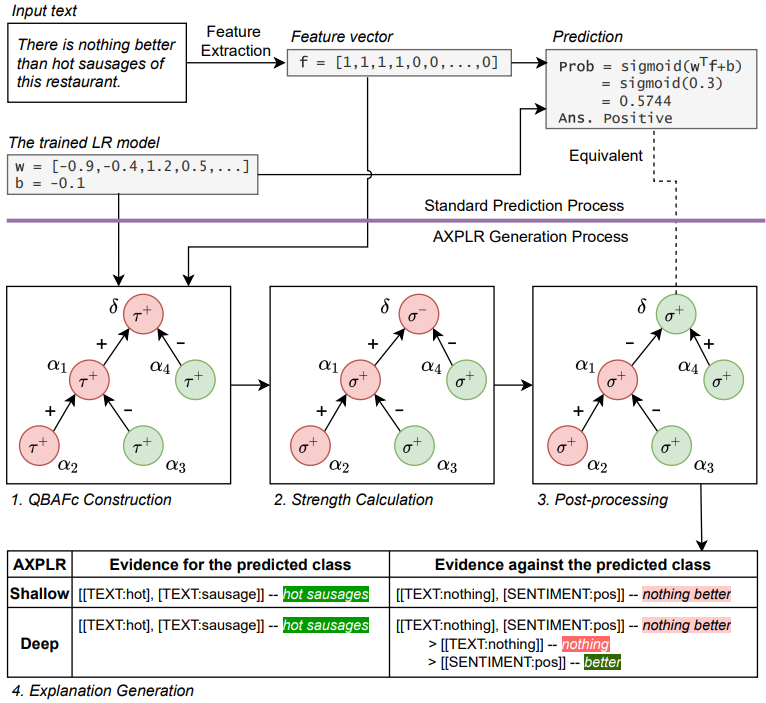

# AXPLR: Argumentative eXplanations for Pattern-based Logistic Regression

**Authors**: [Piyawat Lertvittayakumjorn](https://plkumjorn.github.io/) and [Francesca Toni](https://www.doc.ic.ac.uk/~ft/) (Department of Computing, Imperial College London)

**Paper links**: [ArXiv (pre-print)](https://arxiv.org/pdf/2205.10932)

**Contact**: Piyawat Lertvittayakumjorn (plkumjorn [at] gmail [dot] com)

## Description
**Argumentative eXplanations for Pattern-based Logistic Regression (AXPLR)** can be used to explain predictions of pattern-based logistic regression (PLR) for text classification. 



Above the purple line, it shows the standard prediction process of PLR. Meanwhile, below the purple line, it shows the four main steps to generate AXPLR using a bottom-up QBAFc (BQBAFc), where edges labelled + indicate support and edges labelled - indicate attack.
- Step 1: Constructing a special type of quantitative bipolar argumentation framework (i.e., QBAFc) to represent relationships between the pattern features found in the input text.    
- Step 2: Computing the dialectical strength of each argument, considering its attacker(s) and supporter(s), using the newly-proposed logistic regression semantics.
- Step 3: Post-processing the QBAFc, making all the strength values to be positive and adjusting relations accordingly in a way that preserves the original meaning.
- Step 4: Generating the explanation which could be shallow (using only top-level arguments in the QBAFc) or deep (also using arguments at other levels in the QBAFc)

Please see [our paper](https://arxiv.org/pdf/2205.10932) for more details.

## Requirements
- [Python 3.6](https://www.python.org/downloads/release/python-360/)
- Standard machine learning modules
	- [numpy](https://numpy.org/)==1.19.5
	- [scipy](https://scipy.org/)==1.4.1
	- [pandas](https://pandas.pydata.org/)==1.0.3
	- [scikit-learn](https://scikit-learn.org/stable/)==0.23.2
- Visualization, and interaction modules
	- [matplotlib](https://matplotlib.org/)==3.2.1
	- [plotly](https://plotly.com/python/)==4.14.3
	- [tqdm](https://tqdm.github.io/)==4.46.0
- Specialized modules
	- [grasptext](https://pypi.org/project/grasptext/)==0.0.2
	- [toposort](https://pypi.org/project/toposort/)==1.6

Note that the packages with slightly different versions might work as well.

## Datasets
There are three datasets used in the experiments.
1. SMS Spam Collection (Almeida et al., 2011)
2. Amazon Clothes (He and McAuley, 2016)
3. Deceptive Hotel Reviews (Ott et al., 2011, 2013)

The versions we used for the first and the third datasets are already in the `data` folder, whereas the Amazon Clothes dataset can be downloaded from [here](https://drive.google.com/file/d/1yKgNqbli_loWakg0NpZkmfi3jBj_N7FK/view?usp=sharing). Please place the downloaded dataset (`all_data_AmazonClothes.pickle`) in the `data` folder as well. 

## Paper
**Title**: Argumentative Explanations for Pattern-Based Text Classifiers

**Authors**: Piyawat Lertvittayakumjorn and Francesca Toni

**Abstract**: Recent works in Explainable AI mostly address the transparency issue of black-box models or create explanations for any kind of models (i.e., they are model-agnostic), while leaving explanations of interpretable models largely underexplored. In this paper, we fill this gap by focusing on explanations for a specific interpretable model, namely pattern-based logistic regression (PLR) for binary text classification. We do so because, albeit interpretable, PLR is challenging when it comes to explanations. In particular, we found that a standard way to extract explanations from this model does not consider relations among the features, making the explanations hardly plausible to humans. Hence, we propose AXPLR, a novel explanation method using (forms of) computational argumentation to generate explanations (for outputs computed by PLR) which unearth model agreements and disagreements among the features. Specifically, we use computational argumentation as follows: we see features (patterns) in PLR as arguments in a form of quantified bipolar argumentation frameworks (QBAFs) and extract attacks and supports between arguments based on specificity of the arguments; we understand logistic regression as a gradual semantics for these QBAFs, used to determine the arguments' dialectic strength; and we study standard properties of gradual semantics for QBAFs in the context of our argumentative re-interpretation of PLR, sanctioning its suitability for explanatory purposes. We then show how to extract intuitive explanations (for outputs computed by PLR) from the constructed QBAFs. Finally, we conduct an empirical evaluation and two experiments in the context of human-AI collaboration to demonstrate the advantages of our resulting AXPLR method.

**Paper links**: [ArXiv (pre-print)](https://arxiv.org/pdf/2205.10932)

**Please cite**:
```
@article{lertvittayakumjorn2022argumentative,
  title={Argumentative Explanations for Pattern-Based Text Classifiers},
  author={Lertvittayakumjorn, Piyawat and Toni, Francesca},
  journal={arXiv preprint arXiv:2205.10932},
  year={2022}
}
```
	
